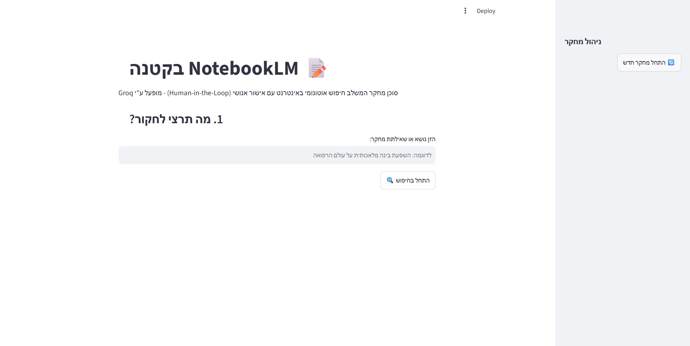
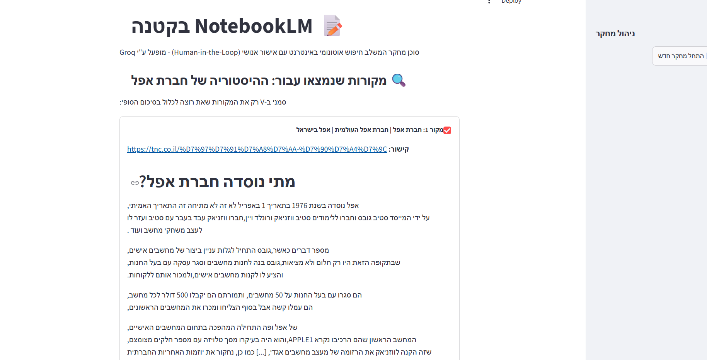
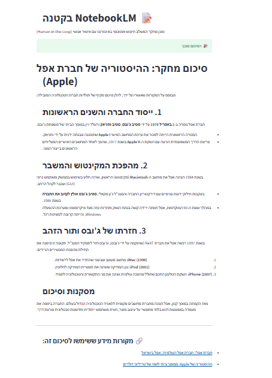
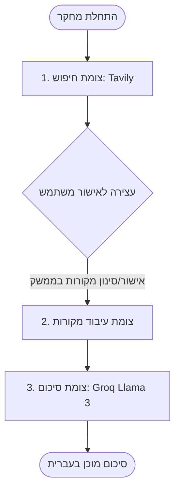

# 📝 NotebookLM Lite (בקטנה)

סוכן מחקר אוטונומי מתקדם המשלב חיפוש בזמן אמת ברשת האינטרנט יחד עם מנגנון **אישור אנושי (Human-in-the-Loop)** וסיכום תכנים אינטליגנטי. הפרויקט מבוסס על ארכיטקטורת סוכנים מבוססת-גרף באמצעות **LangGraph** וממשק משתמש מודרני מבוסס **Streamlit**.

---

## 🚀 תכונות עיקריות

- **חיפוש רשת אוטונומי:** שימוש ב-API של **Tavily Search** כדי לאתר את המקורות העדכניים והרלוונטיים ביותר עבור כל שאילתה.
- **Human-in-the-Loop (HITL):** עצירה מובנית של זרימת העבודה (Workflow) כדי לאפשר למשתמש לבחור ולסנן אילו מהמקורות שנמצאו ייכנסו לסיכום הסופי.
- **מעבד שפה מתקדם (LLM):** יצירת סיכומים מקצועיים בעברית באמצעות מודל **Llama 3.3 (70B)** של חברת Meta, המונע על גבי התשתית המהירה של **Groq**.
- **ניהול מצב (State Management):** שימוש ברכיבי הזיכרון של `MemorySaver` בתוך LangGraph לשמירה וניהול היסטוריית המחקר.
- **ממשק משתמש RTL מלא:** התאמה מלאה של ממשק ה-Streamlit לכתיבה וקריאה מימין לשמאל (RTL).

---

## 📸 צילומי מסך המערכת

### שלב 1: הזנת נושא המחקר


### שלב 2: סקירה ואישור מקורות מידע (Human in the Loop)


### שלב 3: הפקת סיכום מקיף ומקצועי בעברית


---

## 🛠️ טכנולוגיות וכלים

- **Python 3.12**
- **LangGraph** (לניהול גרף המצבים וה-Interrupts)
- **LangChain** (לחיבור וניהול כלי החיפוש והמודל)
- **Streamlit** (עבור ממשק המשתמש הגרפי)
- **Groq API** (מודל שפה Llama 3.3 70B)
- **Tavily API** (מנוע חיפוש מותאם לסוכני AI)

---

## 📐 ארכיטקטורת המערכת (גרף הזרימה)

הסוכן בנוי כגרף מצבים (State Graph) מעגלי מנוהל:



---

## 💻 התקנה והרצה

### 1. דרישות קדם
ודאי שמותקן אצלך במחשב Python 3.10 ומעלה.

### 2. התקנת הספריות הנדרשות
הריצי את הפקודה הבאה בטרמינל להתקנת כל התלויות:
```bash
pip install langchain-core langgraph langchain-groq langchain-community tavily-python streamlit python-dotenv pip-system-certs
```

### 3. הגדרת משתני סביבה
צרי קובץ בשם `.env` בתיקייה הראשית והדביקי בו את מפתחות ה-API שלך:
```env
GROQ_API_KEY=your_groq_api_key_here
TAVILY_API_KEY=your_tavily_api_key_here
```

### 4. הרצת הממשק
הריצי את פקודת ה-Streamlit להפעלת השרת המקומי:
```bash
streamlit run app.py
```
הדפדפן ייפתח אוטומטית בכתובת `http://localhost:8501`.

---

## 🔍 פתרון בעיות (Troubleshooting)

### שגיאות חיבור ואימות אישורי אבטחה (SSL / Connection Errors)
בסביבות רשת מסוימות – כגון מאחורי חומת אש ארגונית (Corporate Firewall), שרתי פרוקסי (Proxy), או מערכות סינון תכנים (כמו נטפרי וכדומה) – פייתון עלול להיכשל באימות תעודת ה-SSL מול שרתי ה-API של Groq או Tavily.

**פתרון מומלץ:**
יש להתקין את החבילה `pip-system-certs` המאפשרת לפייתון להשתמש במאגר אישורי האבטחה של מערכת ההפעלה המקומית (שבה מותקנת תעודת האבטחה המאושרת של הרשת שלכם):
```bash
pip install pip-system-certs
```
במידה והבעיה נמשכת תחת סינון תכנים הדוק, מומלץ לפנות לספק הסינון ולבקש את פתיחת הגישה לכתובת ה-API של גרוק: `https://api.groq.com`.